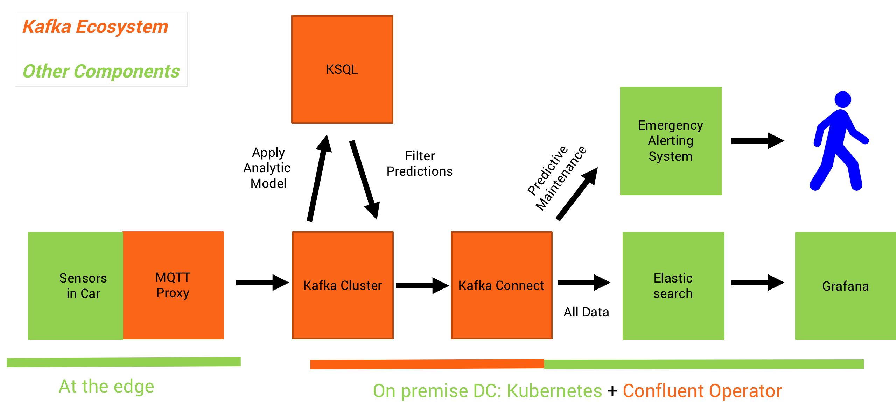
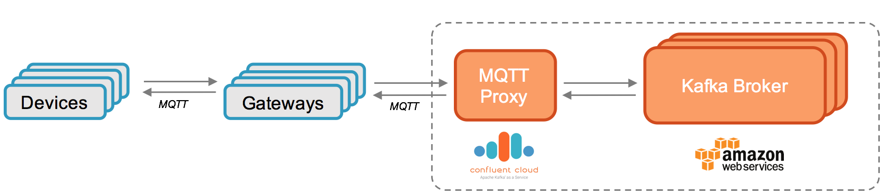

# Deep Learning UDF for KSQL for Streaming Anomaly Detection of MQTT IoT Sensor Data

I built a KSQL UDF for sensor analytics. It leverages the new [API features of KSQL to build UDF / UDAF functions easily with Java](https://docs.confluent.io/current/ksql/docs/udf.html) to do continuous stream processing on incoming events.
If you want to build your own UDF, please check out this blog post for a detailed "how to" and potential issues during development and testing: [How to Build a UDF and/or UDAF in KSQL 5.0](https://www.confluent.io/blog/build-udf-udaf-ksql-5-0).
 
## Use Case: Connected Cars - Real Time Streaming Analytics using Deep Learning
Continuously process millions of events from connected devices (sensors of cars in this example):

## Architecture: Sensor Data via Confluent MQTT Proxy to Kafka Cluster for KSQL Processing and Real Time Analytics
This project focuses on the ingestion of data into Kafka via MQTT and processing of data via KSQL:

## Source Code
Here is the full source code for the [Anomaly Detection KSQL UDF](https://github.com/kaiwaehner/ksql-udf-deep-learning-mqtt-iot/blob/master/src/main/java/com/github/megachucky/kafka/streams/machinelearning/Anomaly.java).

It is pretty easy to develop UDFs. Just implement the function in one Java method within a UDF class:

                @Udf(description = "apply analytic model to sensor input")
                public String anomaly(String sensorinput){ "YOUR LOGIC" }

## How to run it?

### Requirements
- Java 8
- [Confluent Platform 5.0+](https://www.confluent.io/download/) (Confluent Enterprise if you want to use the Confluent MQTT Proxy, Confluent Open Source if you just want to run the KSQL UDF and send data via kafkacat instead of MQTT)
- MQTT Client (I use [Mosquitto](https://mosquitto.org/download/) in the demo as MQTT Client to publish MQTT messages - I don't even start the MQTT server! Thus, you can also use any other MQTT Client instead.)
- [kafkacat](https://github.com/edenhill/kafkacat) (optional - if you do not want to use MQTT Producers, and of course you can also use kafka-console-producer instead, but kafkacat is much more comfortable)

### Step-by-step demo
[Install Confluent Platform](https://www.confluent.io/download/) and [Mosquitto](https://mosquitto.org/download/) (or any other MQTT Client). Then follow these steps to [deploy the UDF, create MQTT events and process them via KSQL leveraging the analytic model](https://github.com/kaiwaehner/ksql-udf-deep-learning-mqtt-iot/blob/master/live-demo-ksql-udf-deep-learning-mqtt-iot.adoc).

## Other Projects related to Kafka and MQTT
If you want to see the other part (integration with sink applications like Elasticsearch / Grafana), please take a look at the project "[KSQL for streaming IoT data](https://github.com/kaiwaehner/ksql-fork-with-deep-learning-function)", which shows how to realize the integration with ElasticSearch via Kafka Connect.

The Github project [Apache Kafka + Kafka Connect + MQTT Connector + Sensor Data](https://github.com/kaiwaehner/kafka-connect-iot-mqtt-connector-example) also integrates with MQTT devices. Though, this project uses Confluent's MQTT Connector for Kafka Connect, i.e. a different approach where you use a MQTT Broker in between the devices and Kafka.

